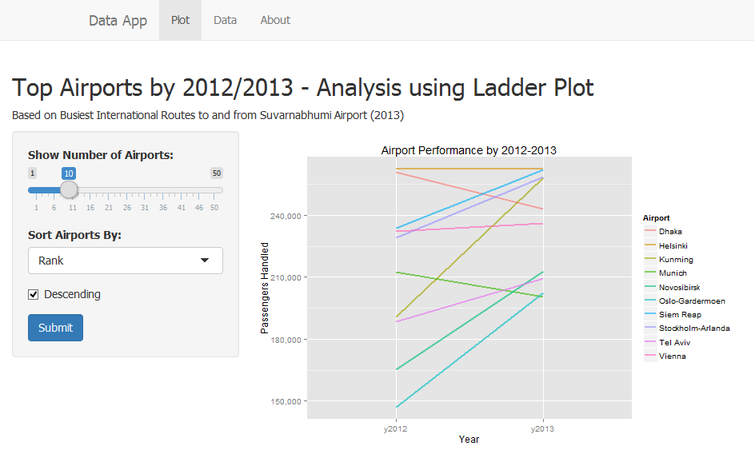
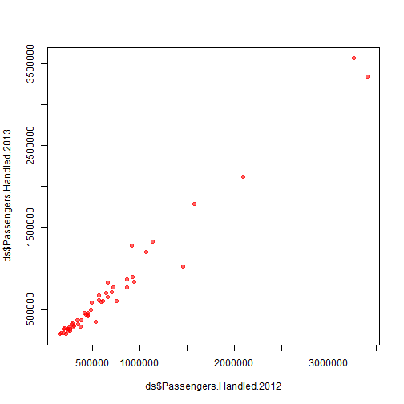

Top Airports by 2012/2013 - Analysis using Ladder Plot
========================================================
author: Sohail Iqbal
date: Sunday, August 23, 2015

Developing Data Products - Course Assignment


Introduction
========================================================
This is my Shiny application for course assignment in which I used a simple dataset from Wikipedia (Source: <https://en.wikipedia.org/wiki/Suvarnabhumi_Airport#Traffic_and_statistics> and introduced ladder plot to analyze performance data with simple yet effective visualization.

The ladder plot shows the relationship between the ranks of data in two or more columns. I have used `ggplot2` and `reshape2` libraries, to generate this plot.

The application is live on Shiny servers at <https://ch3ckmat3.shinyapps.io/DDP-ShinyApp>. The source code of the application is available at <https://github.com/ch3ckmat3/DDP-ShinyApp/>.


The Application
========================================================
The application uses simple Shiny UI and logic to present the
visualization and data for analysis. Here is a screenshot of the final Shiny application:



The Dataset
========================================================
Here is a sample of the data used in the application:

```r
ds <- read.csv("Airports.csv")
head(ds, 2)
```

```
  Rank   Airport Passengers.Handled.2012 Passengers.Handled.2013
1    1 Hong Kong                 3267195                 3566950
2    2 Singapore                 3407354                 3344500
  X..Change2012.13
1             9.17
2            -1.84
```

Sample Plot from Data
========================================================
Here is a plot showing relationship between passengers handled
in the year 2012 and 2013:

 
